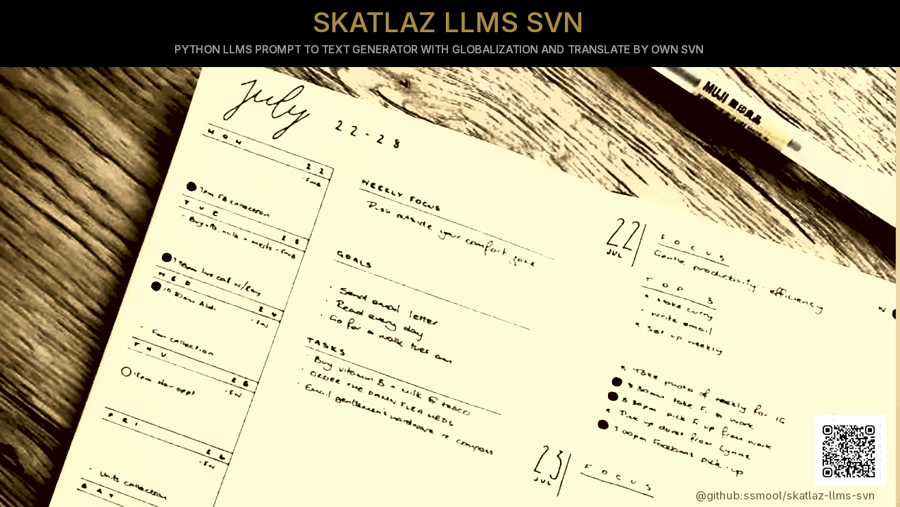

# 🗺️ SKATLAZ WRITER LLMS SVN 🤖

The **SKATLAZ WRITER LLMS SVN** is a pure Python project designed for automated content generation, documentation management, and localization. It simulates an advanced workflow by integrating custom functions for keyword processing, offline LLM text generation, SVN map data management, and HTML report creation.

**Version:** 1.0 Beta

**Status:** Under Development  

**Author:** #asytrick

**Website:** [github.com/skatlaz-llms-svn](https://github.com/ssmool/skatlaz-llms-svn)  

**Contact:** eusmool@gmail.com  


-----

### 🚀 Features

  * **Automated Content Generation:** Uses simulated offline LLM calls to generate content chapters based on defined contexts.
  * **SVN Metadata Integration:** Reads and processes a custom `SVN_MAP.MAPZKXZ` file for context-aware generation.
  * **Intelligent Prompting:** Processes raw keywords into structured tasks (LST\_TODO) by identifying subjects and targets.
  * **Localization (L10N) Simulation:** Includes a function to simulate language detection and translation using a file-based globalization system.
  * **HTML Reporting:** Generates a structured HTML report of all generated chapters and associated metadata.

-----

### ⚙️ Prerequisites

This script uses standard Python libraries. For the LLM and Globalization components, it relies on **simulated functionality**. To implement the actual LLM and advanced NLP features, you would need to install external libraries like:

  * `transformers` or a local LLM package (e.g., Llama.cpp Python bindings)
  * `nltk` or `spaCy` (for actual substantive/subject detection)
  * `langdetect` (for actual idiom detection)

**Required Python Environment:** Python 3.7+

-----

### 📂 Project Structure (Simulated)

The script relies on the creation of specific local directories to simulate the service environment:

```
/skatlaz-llms-svn
├── skatlaz_llms_writer.py  (The main script)
├── SKATLAZ WRITER - SVN/
│   └── SVN/
│       └── SVN_MAP.MAPZKXZ   (Simulated SVN map file)
└── GLOBALIZATION/          (Directory for translation files - simulated)
```

-----

### 📘 SKATLAZ LLMS Manual: Function Explanations

The core functionality is encapsulated in five functions:

| Function Name | Description | Parameters & Types | Return Result & Type |
| :--- | :--- | :--- | :--- |
| `load_svn_map` | Searches for the dedicated SVN directory and reads the `SVN_MAP.MAPZKXZ` file. Parses the content (split by `;`, separated by `,`) and populates the global **`LST_SVN_MAP`**. | None | None |
| `GETPROMPT` | Processes a raw keyword string into structured tasks. It replaces spaces with hashtags, splits the string, identifies principal subjects (simulated substantive/name logic), and categorizes them. | `_KEYWORDS`: `str` (Raw input string) | `LST_TODO`: `List[str]` (List of structured tasks/subjects) |
| `SKATLAZ_WRITER_LLMS` | Simulates the core text generation. It uses the context to look up the (simulated) SVN address and performs an "auto-write" using a placeholder for an **offline LLM**. The generated chapter is added to the global **`LST_CHAPTER`**. | `_CONTEXT`: `str` (A task/subject from `LST_TODO`) | None |
| `TRANSLATE` | Simulates localization. It hypothetically auto-detects the idiom of the context, loads the target dictionary from the `/GLOBALIZATION` directory, and performs word-by-word replacement translation. | `_CONTEXT`: `str` (The text to translate) | `translated_context`: `str` (The translated text) |
| `WORKS_DONE` | Compiles the results from **`LST_CHAPTER`** into a single HTML-formatted report. It includes the prompt context in an `<h2>` tag, the chapter content in a `<span class="_LLMS_RESULT">`, and a generation timestamp in an `<h4>`. | None | `html_output`: `str` (The final HTML report) |

-----

### 🔄 Main Execution Flow

The script's execution sequence ensures data preparation precedes content generation:

1.  **Initialization:** The script begins by ensuring the simulated SVN directories and a dummy `SVN_MAP.MAPZKXZ` file are created if they don't exist.
2.  **`load_svn_map()`:** The SVN map data is loaded, populating the global `LST_SVN_MAP`.
3.  **Prompt Definition:** An initial keyword string (`initial_prompt`) is defined.
4.  **`GETPROMPT()`:** The keywords are processed into a list of tasks/subjects, `lst_todo`.
5.  **Task Iteration:** The script iterates through each item in `lst_todo`.
6.  **`SKATLAZ_WRITER_LLMS()`:** For each context item, a simulated LLM chapter is generated and appended to `LST_CHAPTER`.
7.  **Translation Example:** The `TRANSLATE()` function is demonstrated using the content of the first generated chapter.
8.  **`WORKS_DONE()`:** The final HTML report is generated and printed to the console (and can be optionally written to a file).

-----

### 📝 Example Usage

To run the script, ensure you have the `skatlaz_llms_writer.py` file saved and run it from your terminal:

```bash
python skatlaz_llms_writer.py
```

**Output Snippet (Console):**

```
INFO: Simulating creation of directory: /path/to/SKATLAZ WRITER - SVN/SVN
INFO: Created dummy file: /path/to/SKATLAZ WRITER - SVN/SVN/SVN_MAP.MAPZKXZ
INFO: Loaded 3 records from SVN map.
INFO: Generated 5 task subjects.
INFO: Generated chapter for context: AI_MODEL_GENERATION
INFO: Generated chapter for context: Chapter_on_AI
INFO: Generated chapter for context: Chapter_on_WRITER
INFO: Generated chapter for context: Chapter_on_LLMS
INFO: Generated chapter for context: Full_Context: AI Writer LLMS integration with documentation system using python

--- Translation Example ---
Original Text (Full_Context: AI Writer LLMS integration with documentation system using python): The **SKATLAZ Writer LLMS** initiated a deep search based on the context: 'AI Writer LLM...
Translated Text (PT-BR): The **SKATLAZ Escritor LLMs** initiated a deep search based on the Contexto: 'IA Esc...
---------------------------

=============== FINAL HTML REPORT ===============
<h1>SKATLAZ LLMS AI Generation Report</h1>
<h2>Prompt AI Text: AI_MODEL_GENERATION</h2>
<span class="_LLMS_RESULT>The **SKATLAZ Writer LLMS** initiated a deep search based on the context: 'AI_MODEL_GENERATION'. The relevant SVN source "NAME='MUNDI'" was utilized. This chapter explores the integration of advanced **AI Text Generation** with project metadata, yielding results that demonstrate the power of **Offline LLMs** in automated documentation workflows. This is the generated content for the chapter.</span>
<h4>2025-10-15 10:41:05 - Generated by SKATLAZ WRITER LLMS AI</h4>
<hr>
... (continues for other chapters)
=================================================
```

-----

**Signed by:** \#asytrick
**E-mail:** eusmool@gmail.com
